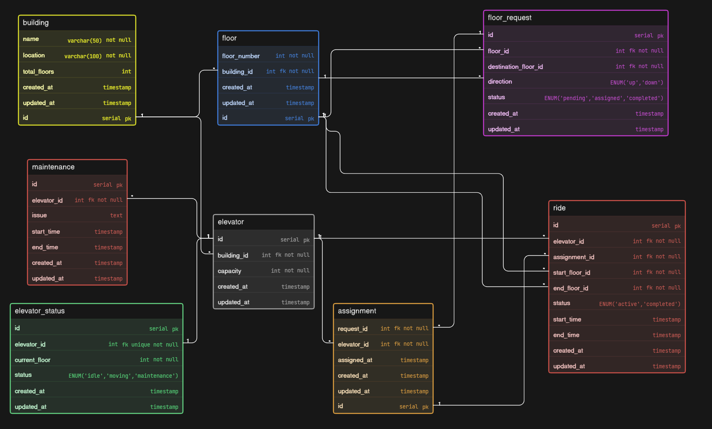

# Elevator System - Database Design (ER Diagram)

## Project Overview

This project presents a **scalable database design** for managing elevators in a multi-floor building.

The system is designed to handle:

* building and floor structure
* elevator management
* floor requests (user calls)
* elevator assignment logic
* ride tracking (movement execution)
* real-time elevator status
* maintenance tracking

The goal is to design a system that is **simple, realistic, and scalable for real-world elevator operations**.

---

## Problem Understanding

This is not just an elevator list.

The key challenge is modeling the **real flow of elevator usage**:

| Concept       | Behavior                              |
| ------------- | ------------------------------------- |
| Floor Request | User presses up/down button           |
| Assignment    | System assigns an elevator            |
| Ride          | Elevator actually moves               |
| Elevator      | Can serve multiple requests over time |

The design separates **request → decision → execution** clearly.

---

## Core Entities

### Building

Represents a physical building.

* name, location
* total floors

---

### Floor

Represents floors inside a building.

* floor number
* linked to building

---

### Elevator

Represents elevators in a building.

* capacity
* linked to building

---

### Floor Request

Represents a user request from a floor.

* source floor
* destination floor
* direction (`up` / `down`)
* status (`pending`, `assigned`, `completed`)

---

### Assignment

Represents system decision of assigning an elevator.

* linked to request
* linked to elevator
* assignment timestamp

---

### Ride

Represents actual elevator movement.

* start floor → end floor
* start time, end time
* status (`active`, `completed`)

---

### Elevator Status

Tracks real-time elevator position.

* current floor
* state (`idle`, `moving`, `maintenance`)

---

### Maintenance

Tracks elevator issues.

* issue description
* maintenance duration

---

## Relationships (Cardinality)

* One **Building** → Many **Floors**
* One **Building** → Many **Elevators**
* One **Floor** → Many **Floor Requests**
* One **Request** → One **Assignment**
* One **Elevator** → Many **Assignments**
* One **Assignment** → One **Ride**
* One **Elevator** → Many **Rides**
* One **Elevator** → One **Status**
* One **Elevator** → Many **Maintenance Records**

---

## Key Design Decisions

### 1. Request → Assignment → Ride Separation

Instead of mixing everything:

* Request = user action
* Assignment = system decision
* Ride = actual execution

This mirrors real elevator systems.

---

### 2. Floor-Based Navigation

* start and end floors are linked via **floor table**
* avoids hardcoding values

---

### 3. Real-Time Status Tracking

* `elevator_status` keeps current position and state
* enables live tracking

---

### 4. Clean Separation of Concerns

* maintenance is separate
* ride logic is separate
* assignment logic is separate

This keeps the system scalable.

---

## Project Structure

```
ElevatorSystem/
│
├── ER-diagram.png
├── eraser-link.txt
└── README.md
```

---

## ER Diagram



---

## Tools Used

* Eraser (for diagram design)

---

## Future Improvements

* Add elevator scheduling algorithms
* Handle multiple requests batching
* Add priority handling (VIP / emergency)
* Track elevator load in real-time
* Add analytics (wait time, usage patterns)

---

## Author

**Tejas**

---

## Final Note

This design focuses on **clarity, real-world flow, and scalability**.

It is built to reflect how a simple elevator system can evolve into a **smart building control system**.
