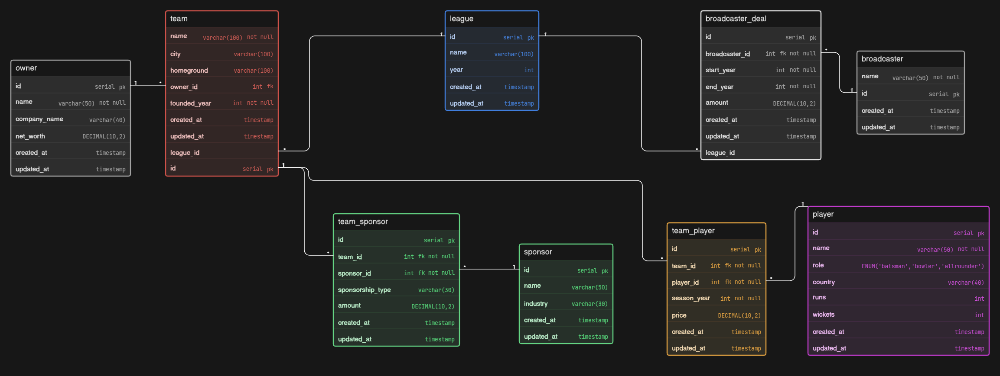

# IPL Management System - Database Design (ER Diagram)

## Project Overview

This project presents a **database design for an IPL-style cricket league system** where teams, players, sponsors, and broadcasters are managed under a central league.

The system is designed to handle:

* league and season management
* team and ownership structure
* player auctions and team assignments
* sponsorship management
* broadcasting deals

The goal is to build a **scalable and structured model** that reflects how a real sports league operates.

---

## Problem Understanding

This is not just a simple team-player system.

The key challenge is modeling:

| Concept     | Behavior                                     |
| ----------- | -------------------------------------------- |
| League      | Central entity managing teams and deals      |
| Team        | Belongs to a league and has multiple players |
| Player      | Can play for different teams across seasons  |
| Team Player | Tracks player-team relation per season       |
| Sponsor     | Can sponsor multiple teams                   |
| Broadcaster | Buys rights for league seasons               |

The design revolves around **league as the central entity**.

---

## Core Entities

### League

Represents the tournament (e.g., IPL 2025).

* name
* year

---

### Team

Represents franchises participating in the league.

* name, city
* homeground
* founded year
* linked to owner

---

### Player

Represents individual players.

* name
* role (batsman / bowler / allrounder)
* country
* performance stats (runs, wickets)

---

### Team Player

Junction table handling player-team relationships.

* season year
* price (auction value)

This allows:

* players to switch teams across seasons
* tracking auction history

---

### Owner

Represents team ownership.

* name
* company
* net worth

---

### Sponsor

Represents brands sponsoring teams.

* name
* industry

---

### Team Sponsor

Handles many-to-many relationship between teams and sponsors.

* sponsorship type
* amount

---

### Broadcaster

Represents media companies with broadcasting rights.

* name

---

### Broadcaster Deal

Tracks broadcasting contracts.

* start year
* end year
* deal amount

---

## Relationships (Cardinality)

* One League → Many Teams
* One League → Many Broadcaster Deals
* One Team → Many Team Player records
* One Player → Many Team Player records
* One Team → Many Sponsors (via Team Sponsor)
* One Sponsor → Many Teams
* One Owner → Many Teams
* One Broadcaster → Many Deals

---

## Key Design Decisions

### 1. League as Central Entity

Instead of loosely connecting entities:

* League acts as the **top-level container**
* Ensures all teams, players, and deals belong to a season

---

### 2. Team–Player via Junction Table

* Avoid direct FK in player or team
* Supports **multi-season transfers and auctions**

---

### 3. Many-to-Many Relationships

Handled using junction tables:

* team ↔ sponsor
* team ↔ player

This avoids redundancy and keeps data normalized.

---

### 4. Season-Based Flexibility

Using `season_year`:

* tracks player history
* supports dynamic team changes

---

## Project Structure

```
IPLManagementDB/
│
├── ER-diagram.png
├── eraser-link.txt
└── README.md
```

---

## ER Diagram



---

## Tools Used

* Eraser (for diagram design)

---

## Future Improvements

* Add match scheduling system
* Add scorecards and player performance per match
* Introduce points table and rankings
* Add auction system logic
* Track injuries and player availability

---

## Author

Tejas

---

## Final Note

This design focuses on **clarity, normalization, and real-world sports league modeling**.

Built to reflect how a tournament like IPL evolves into a structured and scalable system.
