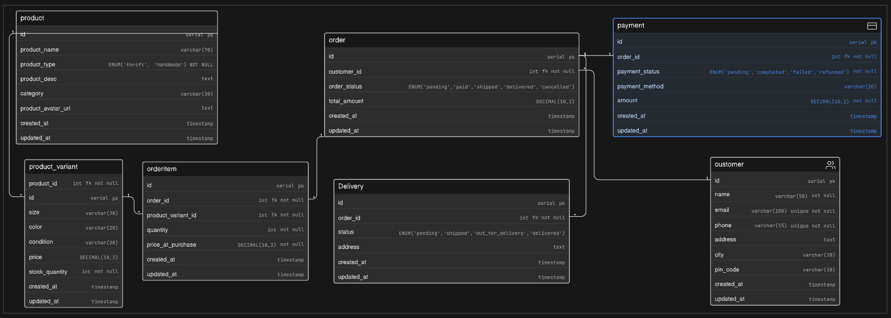

# Instagram Store - Database Design (ER Diagram)

## Project Overview

This project presents a **scalable database design** for a growing Instagram-based store that sells:

* Thrifted fashion items (unique, single-piece products)
* Handmade products (multi-unit inventory)

Initially, orders are handled via Instagram DMs and WhatsApp. As the business grows, this ER diagram provides a structured way to manage:

* product catalog & inventory
* customer data
* order lifecycle
* payment tracking
* delivery status

The goal is to design a system that is **simple for current use but scalable for future growth**.

---

## Problem Understanding

This is not a basic e-commerce model.

The key challenge is handling **two different product behaviors**:

| Type     | Behavior                                                  |
| -------- | --------------------------------------------------------- |
| Thrift   | Only one piece exists, becomes unavailable after purchase |
| Handmade | Multiple units available, managed via stock               |

The database design reflects this difference using a **product + variant + inventory approach**.

---

## Core Entities

### Product

Stores general product-level information.

* name, description
* category
* product type (`thrift` / `handmade`)

---

### Product Variant

Handles actual sellable units.

* size, color, condition
* price
* stock quantity

This allows flexibility:

* thrift → 1 variant, quantity = 1
* handmade → multiple units

---

### Customer

Stores user details:

* name, email, phone
* address, city, pin code

---

### Order

Represents a purchase made by a customer.

* linked to customer
* tracks order status
* stores total amount

---

### Order Item

Junction table between order and product variant.

* quantity
* price at purchase time (important for history)

---

### Payment

Handles payment tracking:

* status (`pending`, `completed`, `failed`, `refunded`)
* method
* amount

---

### Delivery

Tracks shipping lifecycle:

* status (`pending`, `shipped`, `out_for_delivery`, `delivered`)
* delivery address

---

## Relationships (Cardinality)

* One **Customer** → Many **Orders**
* One **Order** → Many **Order Items**
* One **Product** → Many **Variants**
* One **Variant** → Many **Order Items**
* One **Order** → One **Payment**
* One **Order** → One **Delivery**

---

## Key Design Decisions

### 1. Product vs Variant Separation

Instead of storing everything in one table:

* Product = general info
* Variant = sellable unit

This avoids duplication and supports scaling.

---

### 2. Price Snapshot in Order Item

`price_at_purchase` ensures:

* future price changes don’t affect past orders

---

### 3. Inventory Handling

* Thrift → stock = 1
* Handmade → stock managed dynamically

---

### 4. Separation of Concerns

* Payment and Delivery are separate entities
* avoids mixing responsibilities

---

## Project Structure

```
InstagramStore/
│
├── ER-diagram.png       # Final ER diagram
├── eraser-link.txt      # Link to editable diagram
└── README.md            # Project documentation
```

---

## ER Diagram



---

## Tools Used

* Eraser (for diagram design)

---

## Future Improvements

* Add **inventory logs** (stock history tracking)
* Support **multiple payments per order**
* Add **order timeline tracking**
* Introduce **admin/seller roles**

---

## Author

**Tejas**

---

## Final Note

This design focuses on **clarity, normalization, and real-world thinking** rather than over-engineering.

It is built to reflect how a small business **actually evolves into a structured system**.
