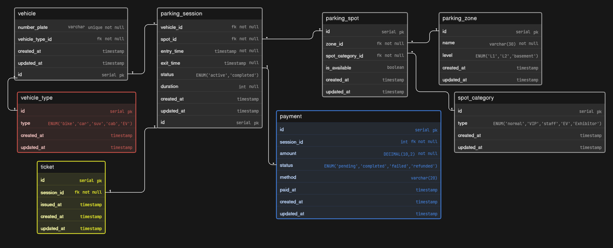

# Parking Management System - Database Design (ER Diagram)

## Project Overview

This project presents a database design for a large-scale event parking system (like Comic-Con), where multiple vehicles enter, park, and exit across different zones and levels.

The system is designed to handle:

* vehicle entry and exit tracking
* parking spot allocation
* zone and level management
* reserved parking categories (VIP, staff, EV, exhibitors)
* ticket generation
* payment tracking

The goal is to build a scalable and practical parking system that reflects real-world event operations.

---

## Problem Understanding

This is not just a parking system.

The key challenge is modeling:

| Concept         | Behavior                                 |
| --------------- | ---------------------------------------- |
| Vehicle         | Can enter multiple times                 |
| Parking Spot    | Can be reused across multiple sessions   |
| Parking Session | Tracks entry → exit lifecycle            |
| Zone            | Contains multiple parking spots          |
| Spot Category   | Defines reservation type (VIP, EV, etc.) |
| Payment         | Linked to each parking session           |

The design revolves around **parking_session as the core entity**.

---

## Core Entities

### Vehicle

Represents vehicles entering the system.

* number plate (unique)
* linked to vehicle type

---

### Vehicle Type

Defines type of vehicle.

* bike, car, SUV, cab, EV

---

### Parking Zone

Represents parking areas.

* zone name
* level (L1, L2, basement)

---

### Spot Category

Defines reservation type.

* normal, VIP, staff, EV, exhibitor

---

### Parking Spot

Represents individual parking slots.

* linked to zone
* linked to spot category
* availability status

---

### Parking Session

Core entity tracking parking lifecycle.

* vehicle assigned
* parking spot assigned
* entry time
* exit time
* status (active, completed)
* duration

---

### Ticket

Generated when vehicle enters.

* linked to parking session
* issued timestamp

---

### Payment

Tracks payment for parking.

* amount
* status (pending, completed, failed, refunded)
* method
* linked to parking session

---

## Relationships (Cardinality)

* One Vehicle Type → Many Vehicles
* One Vehicle → Many Parking Sessions
* One Parking Spot → Many Parking Sessions
* One Parking Session → One Ticket
* One Parking Session → Many Payments
* One Parking Zone → Many Parking Spots
* One Spot Category → Many Parking Spots

---

## Key Design Decisions

### 1. Parking Session as Core

Instead of directly linking vehicle to payment or ticket:

* parking_session connects everything
* tracks full lifecycle (entry → exit)

---

### 2. Separation of Concerns

* vehicle ≠ parking logic
* spot ≠ session
* payment separate from session logic

This keeps system clean and extensible.

---

### 3. Reusability

* one vehicle → multiple visits
* one spot → reused across sessions

---

### 4. Reservation Support

Spot categories allow:

* VIP parking
* staff access
* EV charging
* exhibitor parking

---

## Project Structure

```
ParkingSystemDB/
│
├── ER-diagram.png
├── eraser-link.txt
└── README.md
```
---

## ER Diagram



---

## Tools Used

* Eraser (for ER diagram design)

---

## Future Improvements

* dynamic pricing (based on time or zone)
* real-time availability tracking
* EV charging session tracking
* reservation booking system
* multi-day event pass support

---

## Author

Tejas

---

## Final Note

This design focuses on clarity, reusability, and real-world parking flow.

Built to reflect how a simple parking system can scale into a structured multi-zone event platform.
