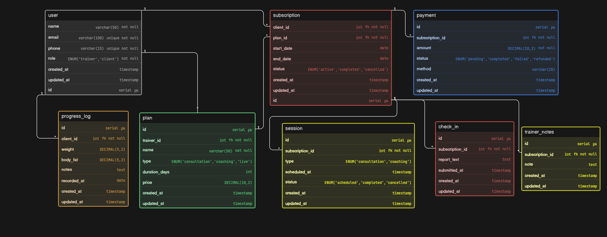

# Trainer–Client Coaching Platform - Database Design (ER Diagram)

## Project Overview

This project presents a **database design for a coaching platform** where trainers manage clients, plans, sessions, and progress.

The system is designed to handle:

* coaching programs (plans)
* client subscriptions
* session scheduling
* payment tracking
* progress monitoring
* client check-ins

The goal is to build a **practical and scalable structure** that reflects real coaching workflows.

---

## Problem Understanding

This is not just a simple user system.

The key challenge is modeling:

| Concept      | Behavior                              |
| ------------ | ------------------------------------- |
| Trainer      | Can handle multiple clients           |
| Client       | Can purchase multiple plans over time |
| Plan         | Can be subscribed by many clients     |
| Subscription | Connects client ↔ plan lifecycle      |

The design revolves around **subscription as the core entity**.

---

## Core Entities

### User

Stores both trainers and clients using a role:

* name, email, phone
* role (`trainer` / `client`)

---

### Plan

Created by trainers.

* plan name
* type (consultation / coaching / live)
* duration
* price

---

### Subscription

Represents a client purchasing a plan.

* start date, end date
* status (active, completed, cancelled)

---

### Session

Scheduled interaction between trainer and client.

* type (consultation / coaching)
* scheduled time
* status

---

### Payment

Tracks payments for a subscription.

* amount
* status (pending, completed, failed, refunded)
* method

---

### Progress Log

Tracks measurable client progress over time.

* weight
* body fat
* notes
* recorded date

---

### Check-in

Client-submitted updates.

* report text
* submission time

---

### Trainer Notes

Trainer feedback for a client.

* notes
* optionally linked to subscription

---

## Relationships (Cardinality)

* One Trainer → Many Plans
* One Client → Many Subscriptions
* One Plan → Many Subscriptions
* One Subscription → Many Sessions
* One Subscription → One/Major Payment
* One Client → Many Progress Logs
* One Subscription → Many Check-ins
* One Trainer → Many Notes for Clients

---

## Key Design Decisions

### 1. Subscription as Core Entity

Instead of directly linking client to plan everywhere:

* Subscription acts as the **central connection**
* Keeps lifecycle clean (start → end)

---

### 2. Separation of Concerns

* Sessions ≠ Check-ins
* Progress ≠ User data
* Payment separate from subscription logic

This keeps the system clean and extensible.

---

### 3. Flexible Coaching Model

Supports:

* one-time consultations
* long-term coaching
* multiple enrollments

---

## Project Structure

```
CoachingPlatformDB/
│
├── ER-diagram.png
├── eraser-link.txt
└── README.md
```

---

## ER Diagram



---

## Tools Used

* Eraser (for diagram design)

---

## Future Improvements

* Support multiple payments per subscription
* Add session feedback system
* Add diet/workout plan modeling
* Introduce notifications/reminders

---

## Author

Tejas

---

## Final Note

This design focuses on **clarity, normalization, and real-world coaching flow**.

Built to reflect how a simple trainer–client system can scale into a structured platform.
